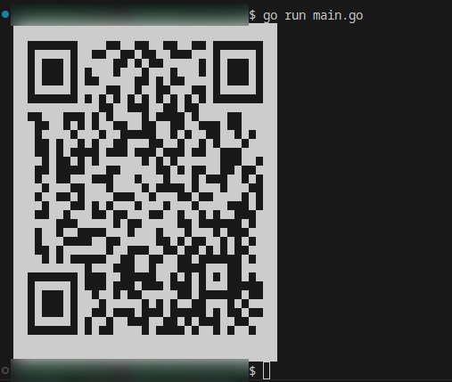

# QR Code Generator

This project is a QR Code generator written in Go that allows you to create QR codes for various types of data, such as URLs, text, and more.

## Installation

To install the necessary dependencies, run the following command:

```bash
go get -u https://github.com/Fameless4ellL/qrcode
```

## Usage

Here is an example of how to use the QR Code generator:

```go
package main

import (
	"log"
	"qrcode/constants"
	"qrcode/image"
	"qrcode/qr"
)

func main() {
	version := 0
	errorCorrection := constants.ERROR_CORRECT_L
	boxSize := 30
	border := 2
	maskPattern := 5

	q, err := qr.NewQRCode(version, errorCorrection, boxSize, border, image.PilImage{}, maskPattern)
	if err != nil {
		log.Fatal(err)
	}
	q.SetVersion(4)

	data := "Hello, world!"

	if err := q.AddData(data, 0); err != nil {
		log.Fatal(err)
	}
	q.PrintASCII(
		nil,
		false,
		false,
	)
}

```
This will generate a QR code with the text "Hello, world!" in the terminal.



## TODO

- Implement functionality to generate QR code images.
- Add options to customize the QR code (e.g., colors, size, error correction level).


## License

This project is licensed under the MIT License.
